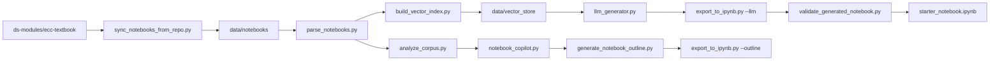

# AI Notebook Builder

A tool that analyzes existing **DSEP / El Camino** Jupyter notebooks and helps generate new starter notebooks using corpus patterns.

Curriculum developers can learn from successful notebooks in the corpus, search for examples, plan new lessons, and export runnable starter `.ipynb` files — without copying notebooks by hand.

---

## The problem

Building educational notebooks takes repeated work:

- Choosing a teaching structure (introduction, objectives, exercises, reflection)
- Writing consistent markdown and section headings
- Scaffolding code cells for students
- Adding widgets and visualizations
- Checking that notebooks are complete and usable before review

Teams often recreate the same patterns notebook after notebook. **AI Notebook Builder** reduces that repetition by learning from an existing notebook corpus and turning those patterns into outlines, drafts, exports, and validation checks.

---

## Features

- **Parse existing notebooks** — extract headings, code, exercises, widgets, and metadata
- **Analyze curriculum patterns** — summarize teaching structures across the corpus
- **Search prior notebook examples** — retrieve and synthesize examples with Notebook Copilot
- **Generate notebook outlines** — plan a new notebook from user inputs
- **Draft reusable notebook sections** — create section-level markdown drafts
- **Export starter `.ipynb` notebooks** — convert outlines or drafts into Jupyter notebooks
- **Validate generated notebooks** — check structure, syntax, and quality before review
- **Sync notebooks from GitHub** — pull `ecc-*` folders from the ECC textbook repo
- **AI notebook generation (RAG)** — retrieve corpus examples and generate drafts with a local Ollama model

---

## Project workflow

```
GitHub repo → sync → parse → analyze → vector search → retrieval → Ollama generation → export → validate
```

The rule-based outline generator remains available as an alternative to AI generation.



**Typical path:** run the full pipeline with one command, or use individual scripts for search, drafting, and export.

---

## Project structure

```
ai-notebook-builder/
├── data/
│   ├── source_repos/    # Cloned GitHub repos (e.g. ecc-textbook)
│   ├── notebooks/       # Synced + manually added .ipynb files
│   ├── parsed/          # Parsed text, metadata, curriculum report
│   ├── generated/       # Outlines, drafts, exported notebooks, validation
│   ├── embeddings/      # Local search index for Notebook Copilot
│   └── vector_store/    # RAG embedding index for AI generation
├── providers/           # LLM provider plugins (Ollama default, OpenAI optional)
├── scripts/             # All pipeline and utility scripts
└── README.md
```

---

## Quick start

Run the full pipeline (syncs from the ECC textbook repo by default, then parses and generates):

```bash
python3 scripts/run_pipeline.py
```

Sync only the `ecc-*` notebooks from GitHub:

```bash
python3 scripts/sync_notebooks_from_repo.py
```

Use existing local notebooks without syncing:

```bash
python3 scripts/run_pipeline.py --skip-sync
```

Specify a different repo URL:

```bash
python3 scripts/run_pipeline.py --repo-url https://github.com/ds-modules/ecc-textbook.git
```

The outline step asks interactive questions (discipline, topic, dataset, coding level, widgets, reflection, length). The pipeline stops if any required step fails.

**Requires:** `git` installed for sync steps.

---

## AI generation setup (Ollama — local, no API key)

### 1. Install and start Ollama

```bash
brew install ollama
ollama serve
```

In another terminal, pull a model:

```bash
ollama pull qwen3:8b
# or: ollama pull llama3.1:8b
```

### 2. Python dependencies

```bash
python3 -m venv .venv
source .venv/bin/activate
pip install -r requirements-llm.txt
```

Optional `.env` settings (copy from `.env.example`):

```
OLLAMA_URL=http://localhost:11434
OLLAMA_MODEL=qwen3:8b
```

No API key required. Generation runs entirely on your machine.

### 3. Build index and generate

Build the vector index after parsing notebooks (rebuild whenever you sync new notebooks):

```bash
python3 scripts/build_vector_index.py
```

Generate a notebook draft with RAG + Ollama:

```bash
python3 scripts/llm_generator.py
python3 scripts/llm_generator.py --model llama3.1:8b
```

Export the AI draft to a starter notebook:

```bash
python3 scripts/export_to_ipynb.py --llm
python3 scripts/validate_generated_notebook.py
```

The generated draft includes an **Influenced By** section listing corpus notebooks used as context.

### Optional: OpenAI instead of Ollama

```bash
pip install -r requirements-openai.txt
```

Add to `.env`:

```
LLM_PROVIDER=openai
OPENAI_API_KEY=your_key_here
```

---

**Outputs:**

- `data/generated/notebook_outline.md`
- `data/generated/starter_notebook.ipynb`
- `data/generated/validation_report.md`

---

## Individual commands

```bash
# Sync notebooks from the ECC textbook repo (ecc-* folders only)
python3 scripts/sync_notebooks_from_repo.py
python3 scripts/sync_notebooks_from_repo.py --repo-url https://github.com/ds-modules/ecc-textbook.git

# Parse and analyze the corpus
python3 scripts/parse_notebooks.py
python3 scripts/analyze_corpus.py

# Search and draft from prior notebooks
python3 scripts/notebook_copilot.py build   # first time only
python3 scripts/notebook_copilot.py "Show me examples of widget usage"
python3 scripts/notebook_copilot.py --draft "Create a beginner widget section for a calculus notebook on Riemann sums"

# Plan, export, and validate a new notebook (rule-based)
python3 scripts/generate_notebook_outline.py
python3 scripts/export_to_ipynb.py --outline
python3 scripts/validate_generated_notebook.py

# AI generation (RAG + Ollama — local, no API key)
python3 scripts/build_vector_index.py
python3 scripts/llm_generator.py
python3 scripts/llm_generator.py --model qwen3:8b
python3 scripts/export_to_ipynb.py --llm
```

On macOS, use `python3` (not `python`).

---

## Example output

A generated **calculus derivatives and integrals** notebook (no dataset) includes:

- **Title and learning objectives** for exploring derivatives and integrals with interactive visualizations
- **Runnable setup code** — `numpy`, `matplotlib`, `ipywidgets`, `interact`
- **Function plotting** — defines `f(x) = x²` and plots it over an interval
- **Derivative visualization** — tangent line at a chosen x-value with a slider
- **Integral visualization** — Riemann sum rectangles with sliders for count and interval bounds
- **Student prompts** — “Try changing…” and “What do you notice?” after interactive cells

The validation report checks structure, Python syntax (without executing code), and flags issues like dataset language when no dataset is used.

---

## Current limitations

- **Two generation modes** — rule-based outlines (fast, offline) and AI generation via local Ollama
- **Human review still required** — generated notebooks are starters, not finished curriculum
- **Local hardware** — larger models (8B+) need sufficient RAM; first generation may be slow while the model loads
- **TF-IDF retrieval** — vector search uses free local embeddings by default; OpenAI embeddings optional with `--openai`

---

## Future improvements

- Add a Streamlit or web interface for non-technical users
- Ollama embedding models for semantic vector search (e.g. nomic-embed-text)
- Support more notebook templates (biology EDA, case studies, coding labs, ethics)
- Execute notebooks during validation to catch runtime errors
- Export separate instructor and student versions

---

## Requirements

- Python 3.10+
- **numpy** (embeddings and Notebook Copilot)
- **git** (notebook sync)

For AI generation (Ollama):

```bash
pip install -r requirements-llm.txt
```

Optional (OpenAI provider instead of Ollama):

```bash
pip install -r requirements-openai.txt
```

Optional (Notebook Copilot semantic search):

```bash
pip install -r requirements-copilot.txt
```

Installs `sentence-transformers` for semantic search in Notebook Copilot (separate from the RAG vector store).
